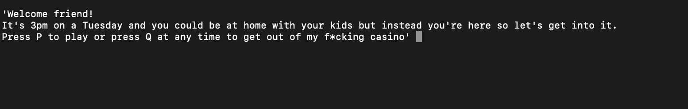
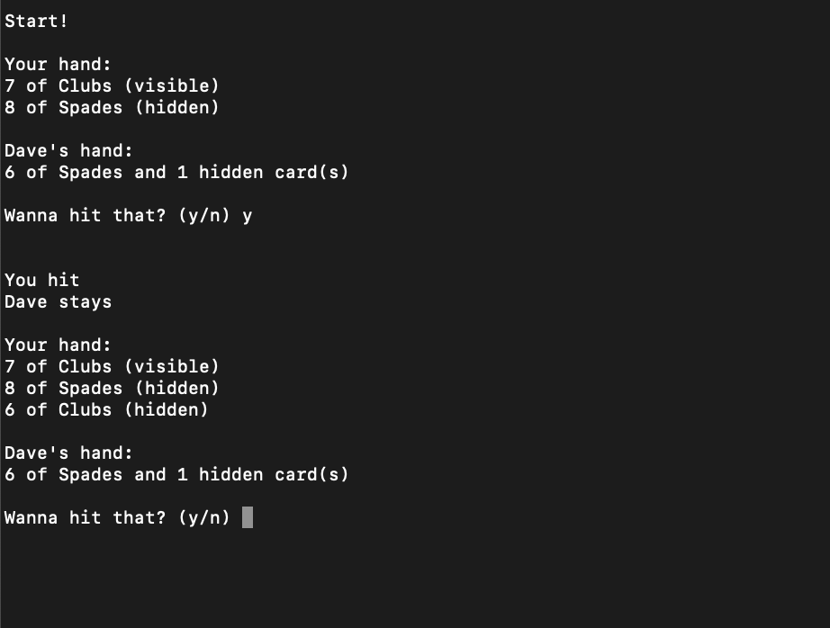
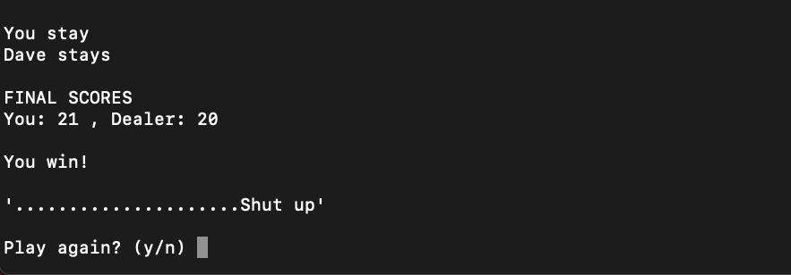
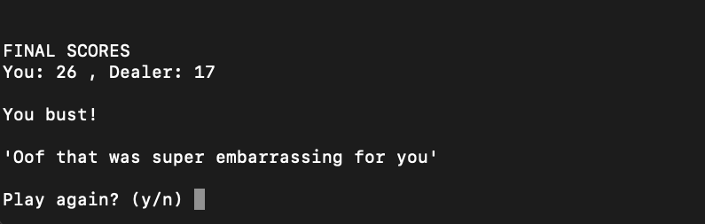

# Rude Blackjack
Welcome to my virtual casino!

Type "`python3 blackjack.py`" into the command line to play!

You'll be playing against Dave, the world's first sassy, card-dealing, foul-mouthed, self-aware (not really), and all around unpleasant AI!

Choose how many decks to use and get going! (It's great practice for counting cards, but don't tell anyone)

Sometimes you'll win!

But mostly you'll probably lose...

So get out there and be the card shark your mother always wanted you to be!

-----

Built in Python 3